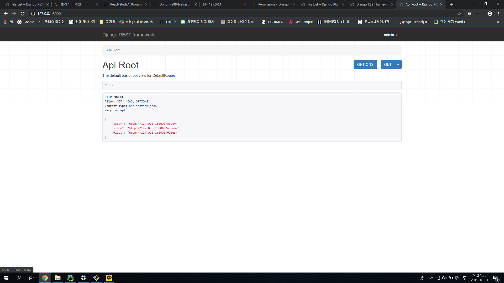
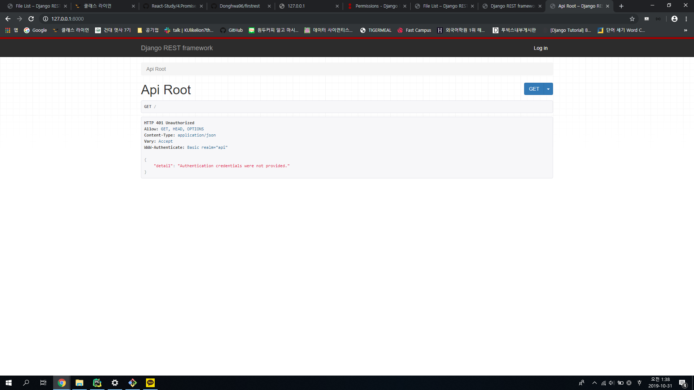
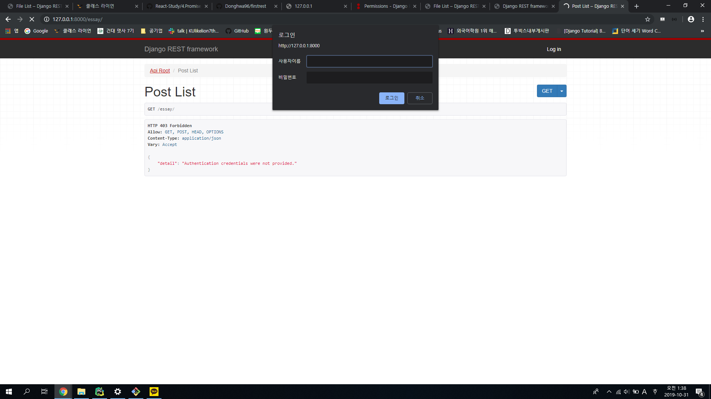
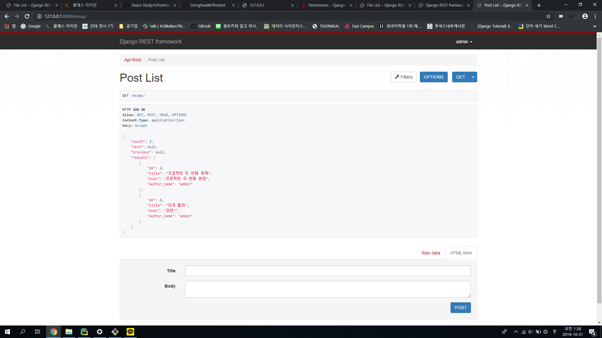
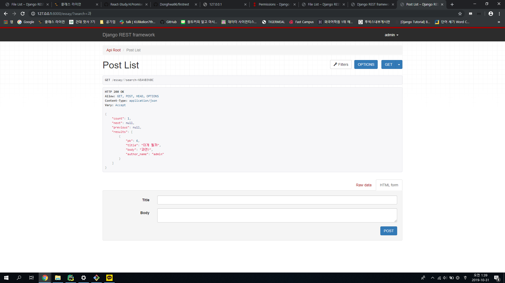
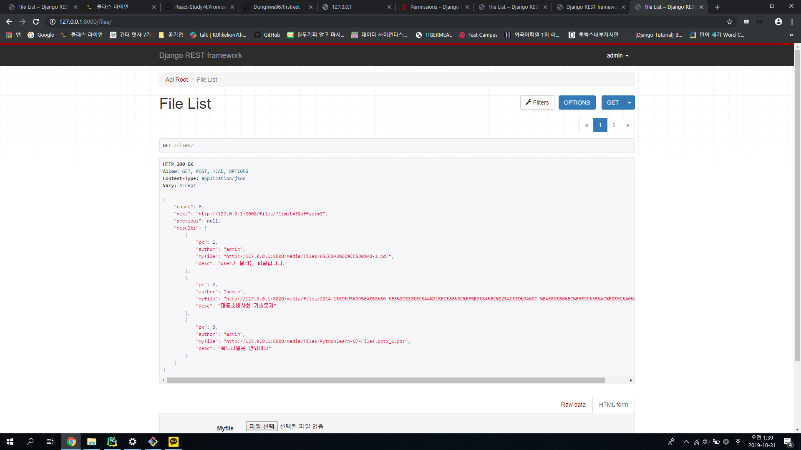

<h1>Django RESTFul FrameWork로 만드는 API 구현 페이지</h1>

<h2>순서대로 정리함.</h2>
<h3>기본 페이지 </h3>

<h3>Authenticated로 인해 로그인을 하지 않으면 저 메시지가 뜸 </h3>

<h3>IsPermission으로 로그인을 하지 않으면 다른 활동을 할 수 없음 </h3>

<h3>유저로 로그인을 한 후 Essay에다 올린 글을 확인 </h3>

<h3>'과'로 검색한 결과 </h3>

<h3>LimitPagination으로 페이지네이션 구현 </h3>

-- 파일 모델을 만든 후 업로드를 할 때 다양한 확장자의 파일을 업로드했는데 이상하게도 docx(워드파일)만 올라가지 않았다. 한번 확인해 봐야겠다.